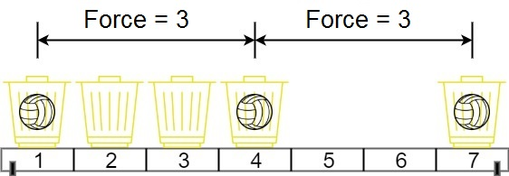

## Решение задачи [1552. Magnetic Force Between Two Balls](https://leetcode.com/problems/magnetic-force-between-two-balls/)

Авторы задачи просят нас принять как данность тот факт, что во вселенной **Earth C-137** сила взаимного притяжения между шарами, помещенными в корзины, **увеличивается** с расстоянием. Нам дано `m` шаров и количество корзин `n`, большее или равное количеству шаров. Позиции корзин даны в массиве `position[]` длины `n`, где для `i` от `0` до `n - 1` `position[i]` - позиция корзины `i`. Авторы просят расположить все шары по одному в корзине так, чтобы минмальное расстояние между ними было максимально возможным.

...Сразу скажу, что в таких задачах правильно понять условие - 80% успеха. 



Если слегка переформулировать условие, то от нас хотят, чтобы мы использовали имеющиеся корзины так, чтобы между **ближайшими** друг к другу шарами оказалось **максимально возможное** расстояние. 

Решить задачу можно последовательно проверяя разные расстояния, пытаясь расположить шары так, чтобы расстояние между соседними шарами не было меньше тестируемого расстояния (силы притяжения, как нам предлагают думать авторы). Для этого сначала **отсортируем** позиции корзин по возрастанию. Теперь все выглядит так, как на приведенной выше схеме. Напишем функцию `Check(force, m)`, отвечающую на вопрос возможно ли расположить шары в корзинах не ближе друг к другу, чем `force`. Раскладывая шары, будем строго соблюдать правило не размещать их в корзинах, находящихся друг к другу ближе, чем `force`. Будем уменьшать счетчик `m` с каждым размещенным шаром. Если удалось довести счетчик до `m <= 0` то операция прошла успешно. В противном случае вернем `false`.

Можно заметить, что если постепенно увеличивать проверяемое минимальное расстояние, то с какого-то момента функция будет давать только отрицательные ответы, а до того - только положительные. Налицо **монотонность** функции. То есть, если расположить результаты функции слева направо по мере возрастания `force`, неизбежно наступит момент, после которого все дальнейшие результаты правее последнего положительного будут отрицательными. Нам нужно просто найти правую границу положительных ответов - ту самую максимально возможную минимальную силу притяжения между шарами разложенными по корзинам (!!!).

Такие задачи эффективно решаются бинарным поиском. Есть один нюанс. В отличие от [задачи про корабли](../1011_Capacity_To_Ship_Packages_Within_D_Days/), где мы ищем **левую** границу положительных значений (там отрицательная зона слева), здесь мы будем искать **правую** границу полложительных значений. Все что правее - отрицательная зона. Если максимально коротко, то разница этих подходов в том в какую сторону будет округлен результат вычисления указателя `mid` в случае, когда расстояние между `min` и `max` равно единице. Так как результат этого вычисления однозначен, то и поведение алгоритма в этом случае несложно отрегулировать.

В случае поиска **правой** границы положительных результатов я использовал такой популярный вариант:

```
while (min < max) {
    int mid = min + ((max - min + 1) >> 1);
    if (Check(position, mid, m)) {
        min = mid;
    } else {
        max = mid - 1;
    }
}
```

Целиком мое решение доступно [здесь](solution.cpp).