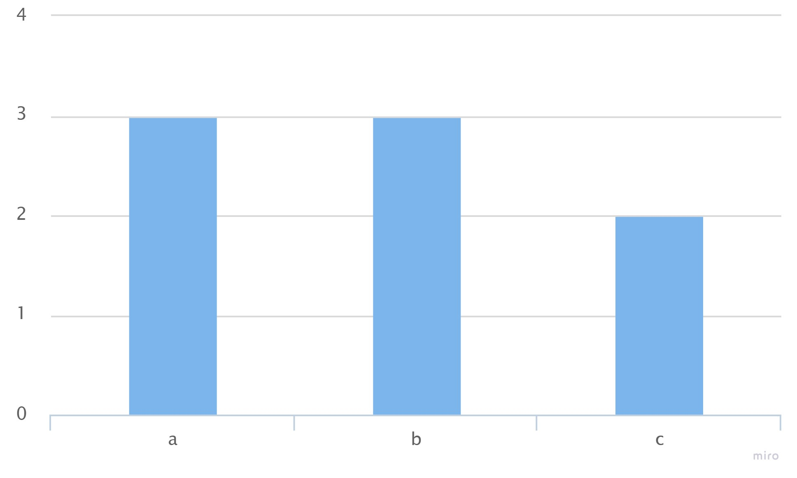
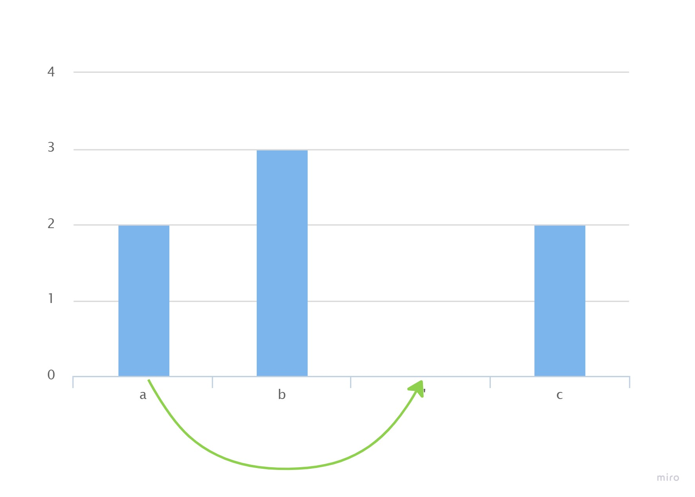

## Решение задачи [1647. Minimum Deletions to Make Character Frequencies Unique](https://leetcode.com/problems/minimum-deletions-to-make-character-frequencies-unique/)

Дана строка `s`, состоящая из строчных букв латинского алфавита. Буквы могут повторяться. Путем минимального количества удалений символов из строки `s` нужно добиться, чтобы любой символ в строке `s` встречался уникальное количество раз. 

Возьмем строку `"aaabbbcc"`. Посчитаем в ней количество повторов символов. Представим результат в виде отсортированного по убыванию множества:

Каждый элемент - частота использования символа в строке `s`.

Наша цель - используя минимальное количество операций так изменить элементы в этом отсортированном множестве, чтобы оно стало **строго убывающим**. Уменьшая значение элемента, мы имитируем удаление символа из строки `s`. Так как нам доступно только удаление символа, то задача - минимальное количество раз уменьшить нужные элементы множества, чтобы отсортированное множество стало строго убывающим.

Если в нашем множестве обнаружились равные элементы, то они будут соседними. Если один из элементов будет уменьшен на единицу, то в отсортированном множестве он займет другую позицию. Если на этой позиции он станет равен своему новому соседу, то элемент придется уменьшить еще раз, и так до тех пор пока он не будет окружен неравными ему соседними элементами. В нашем же случае мы не будем оставлять во множестве элемент равный 0, а просто уберем его, что будет означать отсутствие символа в измененной строке `s`. Как можно заметить, мы проводим операцию только встретив в отсортированном множестве два соседних **равных** элемента. Один из них мы уменьшаем на 1 и помещаем на новое место, чтобы множество осталось отсортированным. Неравные элементы мы не обрабатываем. То есть, двигаясь слева направо, от большего элемента в меньшую строну мы будем попарно сравнивать элементы, и только встретив равные будем проводить уменьшение одного из них и перемещение. Элементы слева нам уже не понадобятся. Налицо однотипное действие с двумя наибольшими элементами подмассива постоянно уменьшающейся длины. 

Это свойство позволяет отнести применяемый алгоритм к категории [жадных](https://ru.wikipedia.org/wiki/Жадный_алгоритм).

А для реализации удобно использовать бинарную кучу с максимальным элементом на вершине. Моя реализация основана на `std::priority_queue`. Сначала посчитываем частоту каждого символа в исходной строке. Затем закидываем все частоты **кроме нулевых** в кучу. Заводим счетчик удалений. Вынимаем из кучи верхний элемент. Если он не равен следующему верхнему, выкидываем его, если равен - уменьшаем на `1`, увеличиваем на `1` счетчик. Если элемент после уменьшения не равен `0`, закидываем его обратно в кучу. Если равен `0` - выкидываем. Если в куче остался один элемент, возвращаем ответ - значение счетчика удалений.

Мое решение лежит [здесь](solution.cpp).