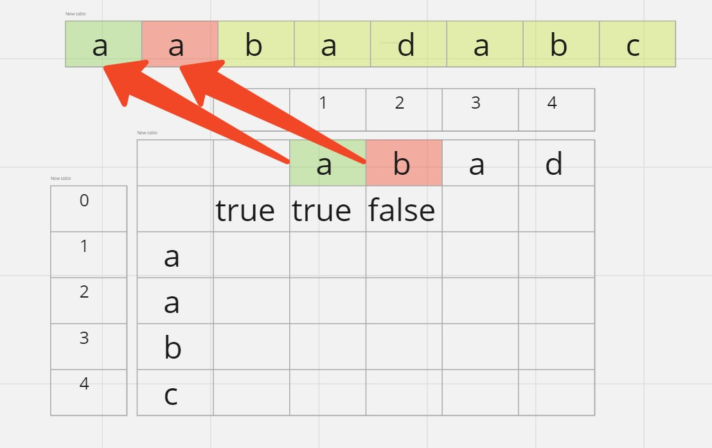
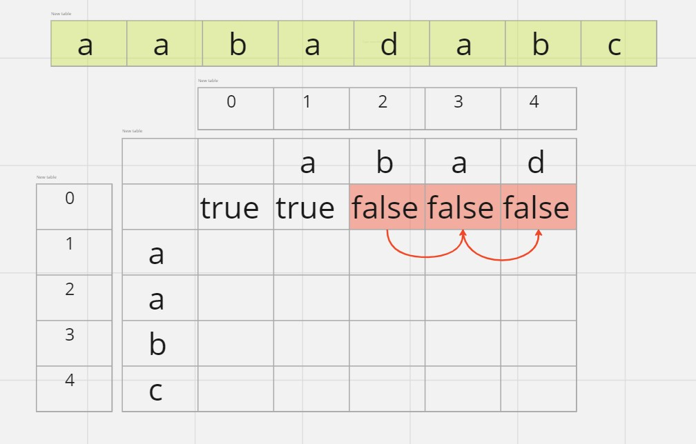
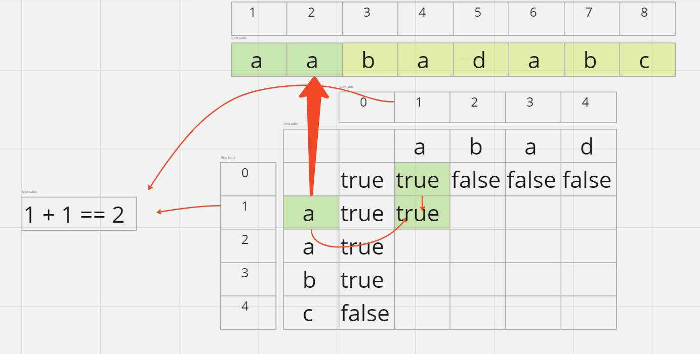
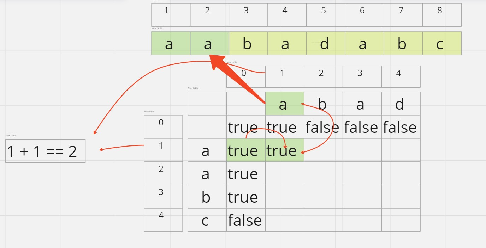
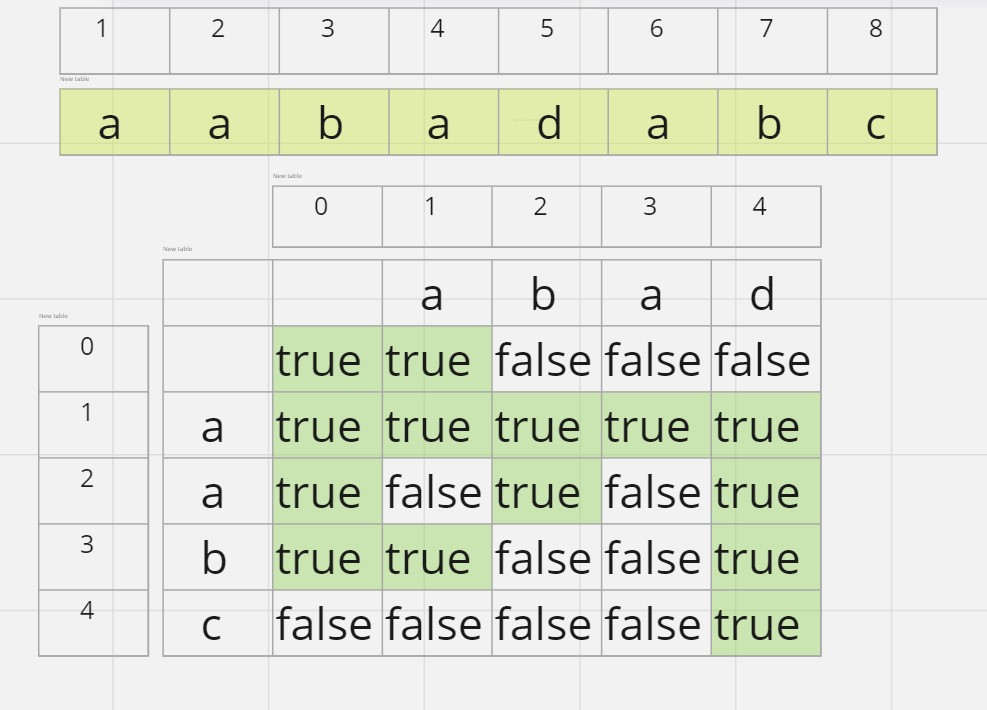

## Решение задачи [97. Interleaving String](https://leetcode.com/problems/interleaving-string/)

На вход поступают три строки `s1`, `s2`, и `s3`. Задача - определить, может ли строка `s3` быть представлена путем чередования последовательно идущих подстрок `s1` и `s2`:

s3 == s11 + s21 + s12 + s22 + s13 + s23 + ... s1n + s2n

Подстроки s11, s12, s13 и т.д. в строке s1 представляют собой непрерывную последовательность и не пересекаются.

Другими словами, нам нужно собрать строку `s3` из строк `s1` и `s2`, чередуя их последовательно расположенные отрезки. После сборки не должно остаться лишних деталей. Если это невозможно, решение должно вернуть `false`.

Задача имеет рекурсивное решение. Наша функция будет давать ответ на вопрос:
- Можно ли из префиксов строк `s1` и `s2` длин `n` и `m` соответственно собрать префикс строки `s3` длины `n + m`. Функция может выглядеть так: `IsInterleave(n, m)`. 

Зная ответ на этот вопрос мы можем попытаться продвинуться по строке `s3` на один символ вперед, используя результат `(IsInterleave(n - 1, m) == true) && (s3[n + m - 1] == s1(n - 1))` OR `(IsInterleave(n, m - 1) == true) && (s3[n + m - 1] == s2(m - 1))`. То есть к успешно пройденному префиксу `s3` длины `n - 1 + m` мы будем пытаться добавить последнюю букву префикса `s1` длины `n` при условии, что `IsInterleave(n - 1, m) == true`. То же касается `IsInterleave(n, m - 1)` и `s2`. Если не удается продвинуться по строке `s3` ни одним из способов - ответ на задачу отрицательный.

Для того, чтобы избежать повторяющихся вычислений, будем сохранять ответы в двумерном массиве `dp_` размера `[n + 1][m + 1]`. Для наглядности представлю его как таблицу:

Основной базой рекурсии будет верхний левый угол: `IsInterleave(0, 0)`. Очевидно, что пустую строку можно собрать из двух пустых строк. Дальше проинициализируем `dp_[0][m]`. Это база для аргумента `n`. Проверим, до каких пор можно продвинуться по префиксу `s3` используя только префикс `s2` для всех `m`: 

 

То же касается `dp_[n][0]` для всех `n`. Для решения `IsInterleave(n, m)` требутся проверить, есть ли решение для `IsInterleave(n - 1, m)` и тогда сравнить символ строки `s3[n + m - 1]` (отнимаем 1, так как здесь индексация с 0) с символом `s1[n - 1]` (с той же целью отнимаем 1):

Также проверим `IsInterleave(n, m - 1)` и `s2[m - 1]`:

Если любой из вариантов дает положительный ответ, то `IsInterleave(n, m) == true`. Ответ на задачу находится в правом нижнем углу `dp_[n][m]`:

Мое рекурсивное решение [здесь](recursive.cpp)

Однако, как можно заметить, двумерный массив здесь избыточен, и нужен только для рекурсивной реализации. Если заполнять его итеративно слева направо сверху вниз, то нам нужна только информация предыдущего ряда и предыдущей ячейки в текущем ряду. Можно обойтись двумя рядами. Мое итеративное решение [здесь](solution.cpp). Для экономии пространства я написал самодельный класс BitSet с возможностью использовать битовые операции для сохранения логических состояний `true` и `false`. Для удобства также реализован доступ к ячейке с помощью привычного оператора `[]`.

